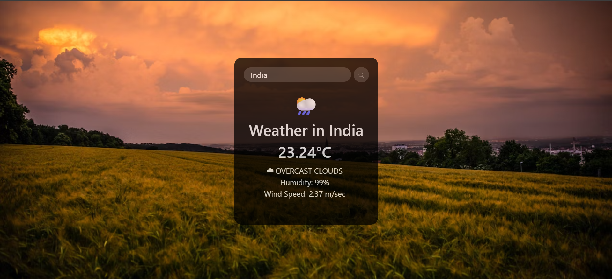

# Weather-Details-Website-using-API
# 🌦️ Weather App
A sleek, responsive web app that allows users to search for any country and instantly view real-time weather data — including temperature, conditions, humidity, and wind speed — using the OpenCage Geocoding API and OpenWeatherMap API.

# Features
1. Country Autocomplete Dropdown — Easily search from a list of 190+ countries.
2. Real-time Weather Data — Fetches temperature, weather condition, humidity, and wind speed.
3. Modern UI — Styled with Bootstrap 5 and a full-screen Unsplash background for a clean and engaging user experience.
4. Responsive Design — Mobile-friendly and visually centered layout.
5. Geolocation-based Fetching — Converts country names to latitude and longitude using the OpenCage API.

# Built With
1. HTML5
2. CSS3
3. JavaScript (Vanilla)
4. Bootstrap 5
5. OpenCage Geocoding API
6. OpenWeatherMap API

# Installation
1. Clone the repository:

 git clone https://github.com/Pratishtha103/Weather-Details-Website-using-API.git
2. Open WeatherApp.html in your browser.

# API Keys
This project uses:
1. OpenCage Geocoding API
2. OpenWeatherMap API

To use your own keys:

Replace the values of api1 and api2 in the JavaScript with your personal API keys:

const api1 = 'YOUR_OPENCAGE_API_KEY';

const api2 = 'YOUR_OPENWEATHERMAP_API_KEY';

# Learnings
This project demonstrates:
1. Handling asynchronous API calls with async/await
2. Parsing and displaying API data on the DOM
3. Styling UI components with Bootstrap and custom CSS
4. Using HTML5 <datalist> for autocomplete functionality
5. Implementing error handling for user inputs and failed fetch requests

# Contributing
Pull requests are welcome! Feel free to fork the repo and submit a PR for improvements or new features.

# License
This project is open source and available under the MIT License.

# Contact
Made with <3 by Pratishtha.
